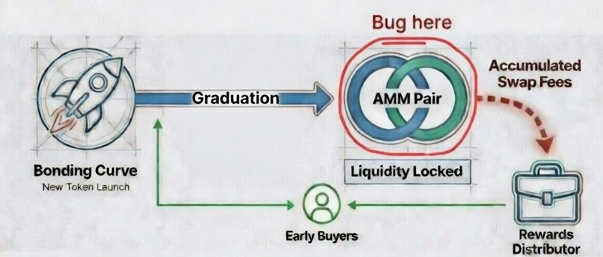
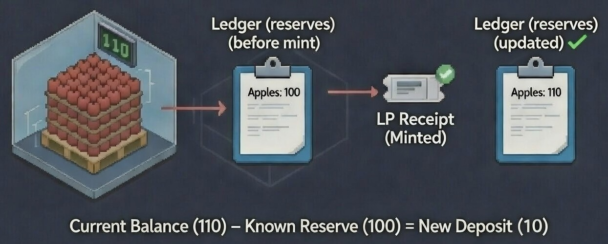
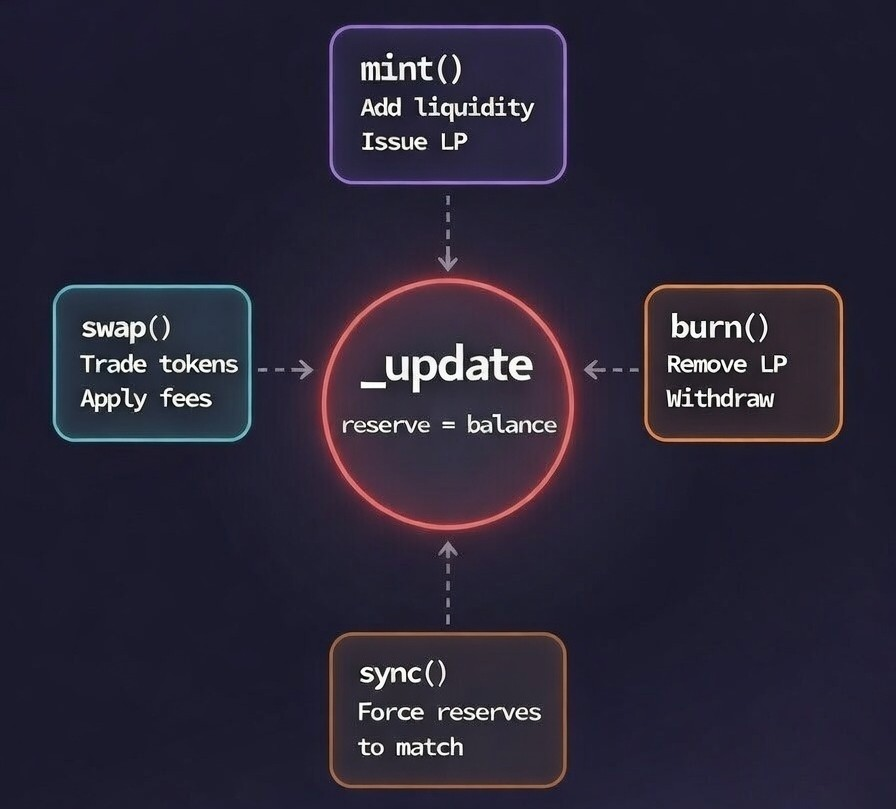
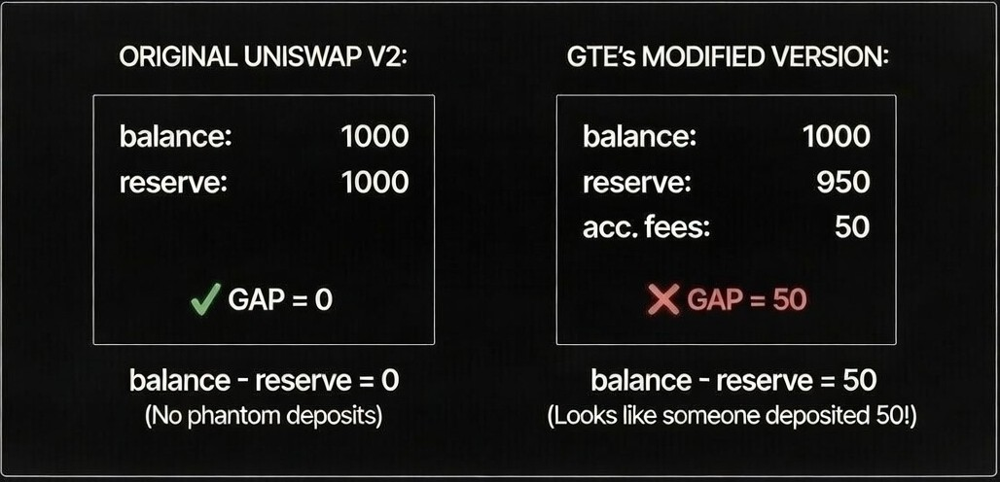
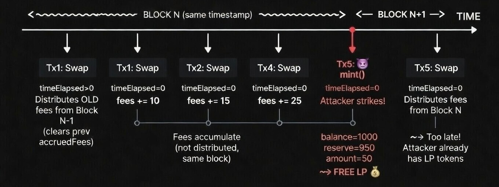
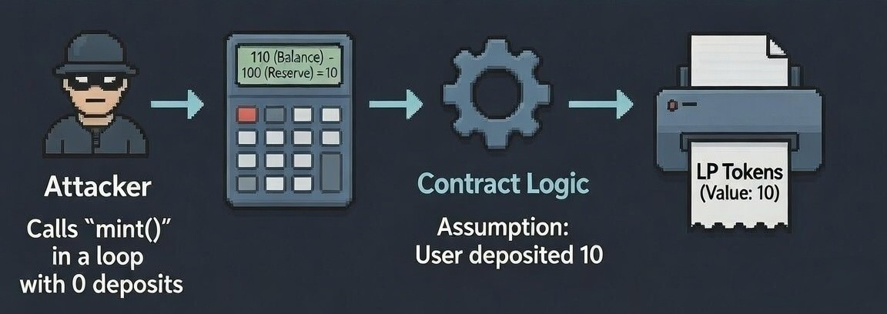
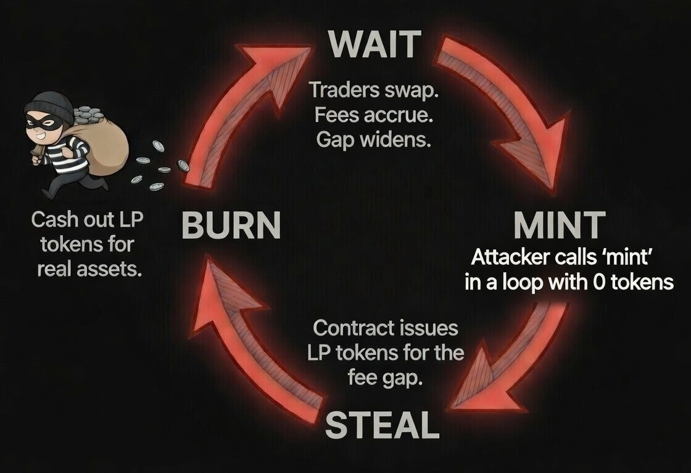

# The Phantom Liquidity: How an accounting error turned a Uniswap V2 fork into a free money printer

 

Uniswap V2 is arguably the most impactful smart contract in DeFi history. It remains the **single most-forked protocol in all of DeFi** by a huge margin, according to [DefiLlama](https://defillama.com/forks), with almost **$2.5 billion in TVL** as of today, sitting in its derivatives alone (Pancakeswap, Sushiswap, etc). It has facilitated [hundreds of millions of swaps](https://blog.uniswap.org/uniswap-v4-is-here) without a single exploit on its original contracts. How many protocols can match that?  

I’ve revisited its codebase countless times over the past four years and I’m always impressed by how simple it is. A constant product formula, a handful of functions, airtight invariants. Permissionless. No governance, no upgradability, no admin keys. Just math. Launched in May 2020, its ~600 lines of Solidity have mass-produced an entire ecosystem.  

Despite the release of V3 and V4 which are more capital efficient, Uniswap-V2 will likely continue to be the copied due to its minimalistic design. But can simplicity be a trap sometimes? Because the code looks easy to modify, teams routinely fork it and change "just one or two lines" — and that's where things have gone wrong.   
For example, **Uranium Finance** was [rekt for $57 million](https://rekt.news/uranium-rekt) in April 2021 after changing a single constant in the swap function.   

For all above reasons, Uniswap V2 has been thoroughly dissected and several excellent breakdowns already exist - [1](https://rareskills.io/tutorials/uniswap-v2-book), [2](https://updraft.cyfrin.io/courses/uniswap-v2), [3](https://hacken.io/discover/uniswap-v2-core-contracts-security/). Writing yet another Uniswap V2 explainer wasn't on my todo list. But despite the protocol being so well studied, we continue to see criticals when teams fork its codebase and make "jUst a feW ChanGes..."  

So here we are, this article walks through one such critical bug I found during my [GTE Perps & Launchpad](https://x.com/GTE_XYZ) audit - where few modified lines turned a working AMM into a free money printer. But fortunately, the bug did not make its way to mainnet.

Whether you're a developer, auditor, or just DeFi-curious — I've tried to make this easy to follow. Included visuals, design choices and code references where needed. Let's get into it.

---

<details>
<summary> 1. Intro : GTE Launchpad  </summary>

## 1. Intro : GTE Launchpad 

In September 2025, the *GTE Perps & Launchpad* protocol went through a competitive audit on Code4rena. Our focus will be on the Launchpad component, where the bug was found.  
A Launchpad typically combines two DeFi elements, here's the GTE launchpad architecture at a high level:



1. **A bonding curve Launchpad** — where early users can participate in buying new tokens launched via a bonding curve (pump.fun style)
2. **An AMM (Automated Market Maker)** — a modified Uniswap V2 fork where graduated tokens trade freely

This particular bug was found in the AMM component of Launchpad.

**This is how it works:**

1. Any person/entity can launch their new token on the bonding curve
2. Early buyers can participate in the sales, and get proportional 'fee shares'
3. When sales reach a certain threshold, the token **graduates** - a Uniswap V2-style AMM pair gets created for secondary trading.
4. The pair collects a portion of swap fees as rewards and forwards them to a **Distributor**, to be claimed by early 'fee shares' holders.

Sounds simple, right?   
However, to make the 'reward-fees' work, the GTE team had to **modify** the battle-tested Uniswap V2 pair contract. And as we'll see, one seemingly innocent modification broke a core invariant that Uniswap V2's entire accounting system depends on.

</details>

---

<details>
<summary>2: Uniswap-V2 Primer </summary>

## 2: Uniswap-V2 Primer 

Before we see what went wrong, let's look at how Uniswap V2 works - especially its Liquidity Pool (LP token) mechanics.

Think of this like a **warehouse receipt system**:
> Imagine a warehouse that stores apples and keeps a ledger (reserves) that says: "We have 100 apples."
> 
> Alice walks in with 10 new apples. The warehouse checks: "the ledger says 100 (reserves), but we now have 110 apples (actual balance). So 10 new apples must have arrived!". The warehouse issues Alice a receipt (LP tokens) for those 10 apples and updates the ledger to 110 apples.



> This receipt can now be used (burnt) to redeem those 10 apples from the warehouse. It does not matter 'who' brings the receipt back. 

>  **The critical assumption:  the ledger (reserves) should always match reality (actual balance) after every user interaction**.    
> If due to whatever reasons, the ledger malfunctions and gets stuck at 100, while the warehouse actually holds 110 apples, the warehouse would assume 10 new apples arrived — and continue to print out receipts for anyone who asks.
> In other words, the warehouse just got rekt and all legitimate receipt holders are rekt along with it.
 
If the above logic is clear, you have the right intuition for the rest of the article. We just elaborate on how the ledger got broken in the GTE's modified Uniswap-V2 implementation.


### The `_update` Function: The Heartbeat of Uniswap V2

Among other things, Uniswap V2 follows one golden rule:

> **At the end of every transaction, the reserves must be equal to the actual token balances held by the contract.**

This is ensured by the [_update](https://github.com/Uniswap/v2-core/blob/master/contracts/UniswapV2Pair.sol#L73-L83) function.

Every time a user interacts with an Uniswap V2 pair - a swap, a mint, a burn - the `_update` function is invoked. It's the heartbeat of the system. 
Here's what it does in the original: 

```solidity
// Original Uniswap V2 _update function
function _update(uint balance0, uint balance1, uint112 _reserve0, uint112 _reserve1) private {
    // ... other logic ...

    reserve0 = uint112(balance0);   // <-- reserves = balances. Always.
    reserve1 = uint112(balance1);   
}
```



This design is simple. The reserves are set to whatever the contract's actual token balances are at the end of a transaction. No exceptions.

### Why This Matters

To know why this matters, let's look at how LP tokens are minted.
When someone wants to provide liquidity, they can do so in two ways: 

**Method 1: Via the Router (recommended, user-friendly)**

You call addLiquidity() on the `Router`, and it:

1. Transfers your tokens from your wallet to the Pair contract
2. Calls mint() on the Pair contract on your behalf and returns any excess tokens back to you 

Just one call — the Router does the heavy lifting.

**Method 2: Direct (low level, advanced)**

You interact with the Pair contract directly. 
This requires two steps in one transaction (typically via a custom contract):

1. Transfer both tokens directly to the Pair contract address
2. Call [`mint`](https://github.com/Uniswap/v2-core/blob/master/contracts/UniswapV2Pair.sol#L110-L131) on the Pair contract yourself in the same transaction

This is basically the same as method 1 and how the Router works under the hood.
But when doing it manually, you have to get the token ratios right yourself and bundle both steps atomically.
The takeaway is that, the 'mint' function is permissionless and anyone can directly call it. 


Now let's look at the original Uniswap V2 `mint` function [here](https://github.com/Uniswap/v2-core/blob/master/contracts/UniswapV2Pair.sol#L110)

```solidity
function mint(address to) external lock returns (uint liquidity) {
    (uint112 _reserve0, uint112 _reserve1,) = getReserves();
    uint balance0 = IERC20(token0).balanceOf(address(this));
    uint balance1 = IERC20(token1).balanceOf(address(this));

    uint amount0 = balance0.sub(_reserve0);  // How many new tokens arrived?
    uint amount1 = balance1.sub(_reserve1);  // Compare balance vs reserves

    // ... LP token calculation ...
    liquidity = Math.min(
        amount0.mul(_totalSupply) / _reserve0,
        amount1.mul(_totalSupply) / _reserve1
    );

    _mint(to, liquidity);
    _update(balance0, balance1, _reserve0, _reserve1); // <@ See, Update is called at the end
}
```
Here are the key assumptions:

```
new_amount_deposited = actual_balance - Previously_stored_reserves

new reserves == actual balance // at the end of every call
```
This ensures, only legitimate mints, burns, and swaps can happen.

If by chance the 'reserves < actual balance' when you directly call 'mint' then its your lucky day - you get free LP tokens.  
But dont get excited, this will never happen in Original Uniswap V2.

</details>

---

<details>
<summary> 3: What Went Wrong - the 'reward-fees' accumulation that broke everything  </summary>

## 3: What Went Wrong - the 'reward-fees' accumulation that broke everything

We know Uniswap V2 charges a fixed 0.3% fee on every swap. 
The clever part is, this fee is never extracted or sent anywhere separately. The fee stays in the pool and **automatically benefits all LP holders** when they eventually withdraw. After each swap, the pool holds *slightly more* tokens than before, and the reserves are updated to match. 
No separate tracking. No fee variables. No gap between balances and reserves. 
The golden rule (`reserves = balances`) is never broken.

### What GTE Wanted: A Second Fee Layer (let's call it "reward-fees")

The GTE team wanted something more. They wanted to reward their early launchpad buyers. On top of Uniswap V2's standard 0.3% fee (which benefits LP holders), they tried to carve out an additional sub-fee (0.1% reward-fees) - and redirect it to a 'Distributor' contract, which can be claimed by those early buyers. 

To do this, they introduced a concept of **"accrued launchpad fees"** — a portion of swap fees set aside for distribution, which is a very reasonable idea. But, the issue comes from *how* they implemented it.

### The modified `_update` function

Here's how GTE modified the sacred `_update` function. 
Especially pay attention to two things: 
- the `timeElapsed` branching 
- the final reserve assignment


```solidity
// GTE's modified _update function 
// Source: GTELaunchpadV2Pair.sol
function _update( // .... original parameters
    uint112 newLaunchpadFee0, uint112 newLaunchpadFee1  // <-- NEW: fee parameters
) private {
    uint112 totalLaunchpadFee0 = accruedLaunchpadFee0 + newLaunchpadFee0;
    uint112 totalLaunchpadFee1 = accruedLaunchpadFee1 + newLaunchpadFee1;

    // fee distribution logic ...
    uint32 timeElapsed = blockTimestamp - blockTimestampLast;
 
    if (timeElapsed > 0 && _reserve0 != 0 && _reserve1 != 0) {
    // NEW BLOCK: Distribute accumulated fees
    if (totalLaunchpadFee0 | totalLaunchpadFee1 > 0) {
        // ...
        _distributeLaunchpadFees(totalLaunchpadFee0, totalLaunchpadFee1);
    }
    } else if (newLaunchpadFee0 | newLaunchpadFee1 > 0) {
        // SAME BLOCK: Just accumulate, don't distribute yet
        accruedLaunchpadFee0 = totalLaunchpadFee0;
        accruedLaunchpadFee1 = totalLaunchpadFee1;
    }

    // 💀 THE GOLDEN RULE IS BROKEN : reserves ≠ balances 
    reserve0 = uint112(balance0) - totalLaunchpadFee0; 
    reserve1 = uint112(balance1) - totalLaunchpadFee1;  

    blockTimestampLast = blockTimestamp;
}
```

Firstly, notice the `timeElapsed > 0` check. The **'reward-fees' aren't distributed on every swap**. Instead, they're batched and distributed once per block. 
The 'reward-fees' silently accumulate within a block and are only distributed when a new transaction arrives in the subsequent blocks.

Why the batching? Presumably gas optimization. Calling `_distributeLaunchpadFees()` (which invokes the external Distributor contract) for every swap seems expensive.  

Secondly, instead of setting `reserves = balances` (like the original Uniswap V2), 
GTE sets:
```
reserves = balances - accumulated_fees
```
This creates a **gap** between what the contract actually holds VS what it claims to hold. 



### The fee accumulation logic that backfired
 
They made three design choices that, when combined, broke the system:
 
1. **Keep 'reward-fees' tokens inside the pair contract** instead of transferring them out immediately.
2. **Subtract the accumulated fees from reserves** in the `_update`, creating an artificial gap between actual holdings and reported state.
3. Left **`mint`, `burn`, and `swap` unmodified** — none of them account for this gap.
 


**Do you see it?**

The batched distribution logic creates a **dangerous window**. A window between the swaps that accumulate 'reward-fees' and the next block that distributes them. 
During this window, the 'accrued-but-undistributed-fees' sit inside the contract — deflating the reserves below the actual balance. And as we're about to see, that gap is an open invitation for an attacker.


### The Attack: LP Tokens from thin air

Remember how `mint()` calculates how many tokens were deposited?

```solidity
// In mint():
uint256 amount0 = balance0.sub(_reserve0);   // balance - reserve
uint256 amount1 = balance1.sub(_reserve1);   // balance - reserve

require(liquidity > 0, 'UniswapV2: INSUFFICIENT_LIQUIDITY_MINTED');
_mint(to, liquidity);
```

In original Uniswap V2, if an attacker directly calls mint without depositing any tokens, 
the transaction would revert with `INSUFFICIENT_LIQUIDITY_MINTED` as shown in the code above, since `balance == reserve` 

**But in GTE's version**, even when nobody deposits anything: 
The contract **thinks** someone deposited new tokens — due to the accrued fee gap. This results in `amount0` and `amount1` being non-zero.

```
amount0 = balance0 - reserve0 = 1000 - 950 = 50  (the fee gap!)
amount1 = balance1 - reserve1 = 1000 - 950 = 50  (the fee gap!)
```


Now the `mint()` function happily mints new LP tokens for this **"phantom deposit"** - to anyone who calls it. To make matters worse, the mint can be called repeatedly in a loop, minting unlimited LP tokens - like there's no tomorrow.



###  The Irony: They patched one leak in a dam and walked away.

The interesting part is, **the GTE team actually recognized that the fee gap would break things.** 
This is shown by how they modified the `skim()` function to adjust for accumulated fees:

```solidity
// GTE's modified skim() — they KNEW about the fee gap!
function skim(address to) external lock {
    address _token0 = token0;
    address _token1 = token1;
    _safeTransfer(_token0, to, 
        IERC20(_token0).balanceOf(address(this)).sub(reserve0 + accruedLaunchpadFee0));
        //                                                       ^^^^^^^^^^^^^^^^^^^
        //                                                       They added this fix! 
    _safeTransfer(_token1, to, 
        IERC20(_token1).balanceOf(address(this)).sub(reserve1 + accruedLaunchpadFee1));
}

```
They reinforced the `skim` entrance — clearly aware someone could walk in. But they left `mint`, `burn`, and `swap` wide open.


</details>

---

<details>
<summary> 4: The Ripple Effect </summary>

## 4: The Ripple Effect

This broken invariant doesn't just affect LP minting. It cascades through **every function** that relies on the relationship between balances and reserves.

The original Uniswap V2 code has a clean dependency graph. The `_update` function is called by four important functions (as we have seen above). Of these, `mint`, `burn`, and `swap` all rely on the invariant `reserves = balances` for their core accounting. 

### 1. `swap()` — Incorrect Input Amount Calculation 

```solidity
// In [swap](https://github.com/Uniswap/v2-core/blob/master/contracts/UniswapV2Pair.sol#L159)
uint256 amount0In = balance0 > _reserve0 - amount0Out ? 
                    balance0 - (_reserve0 - amount0Out): 0;
```

Since `reserve0 < balance0`, the contract overestimates the amount of tokens the trader sent in, which means the K invariant check is applied against inflated values. This subtly distorts swap pricing.

### 2. `burn()` — LP Holders Receive Fee Tokens 

```solidity
// In [burn](https://github.com/Uniswap/v2-core/blob/master/contracts/UniswapV2Pair.sol#L134)
amount0 = liquidity.mul(balance0) / _totalSupply;  // @> Uses balance, not reserve!
amount1 = liquidity.mul(balance1) / _totalSupply;
```
The `burn()` function distributes tokens based on **actual balances**, which includes the accumulated fees. This means anyone can call it and extract a portion of the fees meant for the 'Distributor'.

Although this article was written from the perspective of `mint`, the broken invariant in `_update` compromises the integrity of every dependent function in the system.

</details> 

---

<details>
<summary> 5: How could this have been avoided?</summary>

## 5: How could this have been avoided?

### How did it slip through?

It's worth noting: this attack only works under specific conditions. It requires multiple swaps in the same block, in both directions, such that the `reserve0 < balance0` and `reserve1 < balance1`. Basically, the fees should accrue on *both* token sides.  
This subtlety is part of what made the bug easy to miss — and hard to catch with basic unit tests.  

That said, a simple invariant test or formal verification with a tool like [Certora](https://rareskills.io/tutorials/certora-book) would have flagged this vulnerability.

### The Fix
 
The vulnerability could have been prevented in at least two ways:
 
1. **Distribute reward-fees immediately** — transfer fee tokens out of the pair during the swap itself, so `balance` drops accordingly and `reserves = balances` holds after `_update`.
2. **If batching is preferred**, modify `mint`, `burn`, and `swap` to account for the accumulated fee gap — the same way they already fixed `skim()`.

### The bigger lesson : Be Paranoid

Whenever you try to modify a battle-tested protocol, visualise **walking on a minefield**. Every line exists for a reason.

- **Map every assumption** the original code makes.
- **Trace every function** that reads the state you're modifying.
- **Ask yourself**: "If I change X, what breaks downstream?"

Think of all potential edge cases - *"What if this assumption no longer holds in a particular scenario?"*, and then write invariant tests that enforce it, formally verify them for your own peace of mind. 

</details>

---   
If you want to stress-test your protocol before an attacker does — feel free to DM [Aura](https://x.com/0xArav). At the least, I can connect you to the right person. Stay safe.


